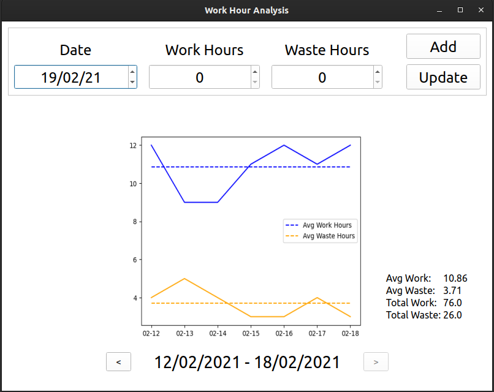

# Work-Hours-Analysis

[](https://www.python.org/)  

This is a program one can use to monitor the hours put into work on daily and weekly basis. The project was created because of the personal need to track hours each day that are put into work and those which are wasted.  

The hours put into work each day can decide the future of an individual, and hence maximizing the work hours and minimizing the hours wasted on things that are not necessary is really important in order to improve productivity.

## Jump To

- [Interface](https://github.com/Sanket-Mathur/Work-Hours-Analysis#interface)
- [Requirements](https://github.com/Sanket-Mathur/Work-Hours-Analysis#requirements)
- [Run the Project Locally](https://github.com/Sanket-Mathur/Work-Hours-Analysis#run-project-locally)
- [Working of the project](https://github.com/Sanket-Mathur/Work-Hours-Analysis#working-of-the-project)
- [Steps to Contribute](https://github.com/Sanket-Mathur/Work-Hours-Analysis#steps-to-contribute)

## Interface



## Requirements

- Python
    - sqlite3
    - numpy
    - matplotlib
    - PyQt5
    
## Run Project Locally

- Download the project in zip format and extract it  
- Open you command line and change the location to the project folder  
- Run the following command
    ```
    pip install -r requirements.txt 
    ```  
- Setup the DataBase
    ```
    python setup.py
    ```   
- Change the location into the CLI or GUI folder and follow the steps

## Working of the project
- The Management class in the DataBase/db.py contains methods for managing the database and offers the functionality to:
    - Create table
    - Print table
    - Insert data 
    - Update existing data
    - Check if row with specified date exists
    - Return data 
- The setup.py script make use of Create table operation of the Management class to setup a database
- GUI consists of just one script which opens an interface in a desktop window and uses the class Methods to insert, update and visualise the data along with additional features of observing week stats and shift between existing weeks.
- The CLI consists of two scripts responsible for inserting and analysing records respectively. 
- DataBase management features are used from the sqlite3 module
- All the analysis is performed using matplotlib and stored as an image to represent the plot in the GUI application.


## Steps to Contribute
- Fork the repository
- Run the cloned project locally
- Update the software locally and commit the changes
- Push the changes from you local machine to your remote repository
- Create a Pull Request with a description of the updations perform and/or any issues you are referencing
- Follow up with the pull request if any comments till it is merged
